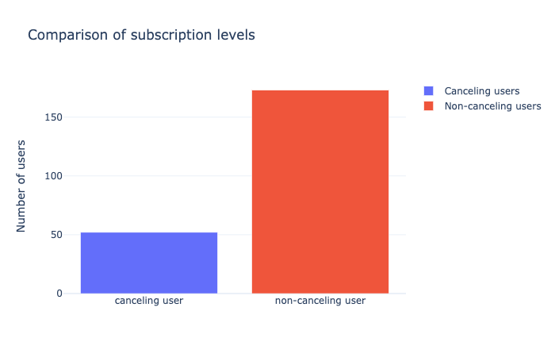
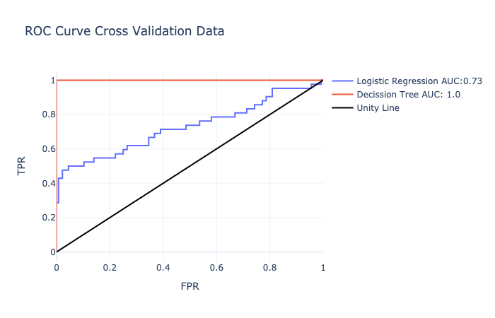
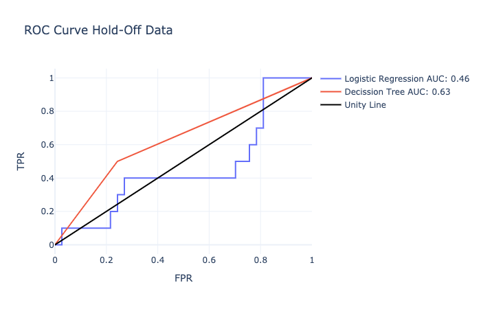
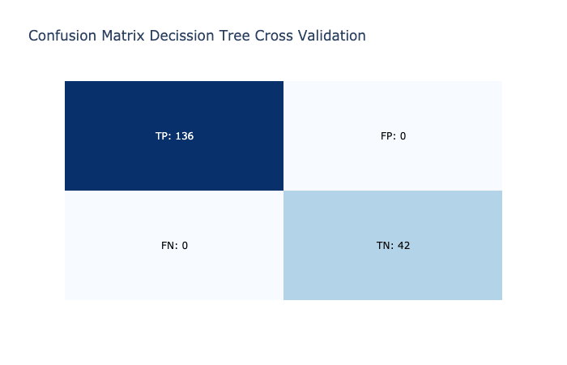
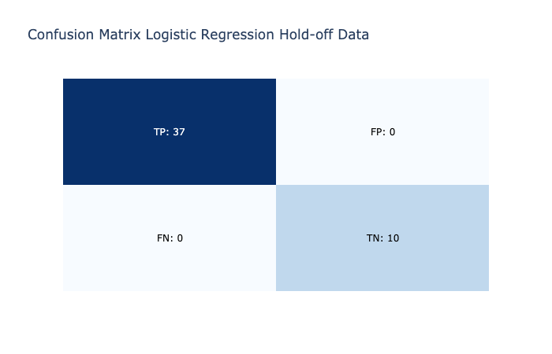
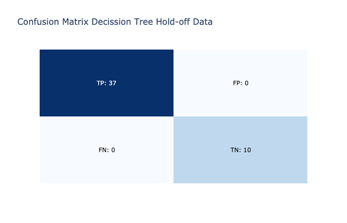
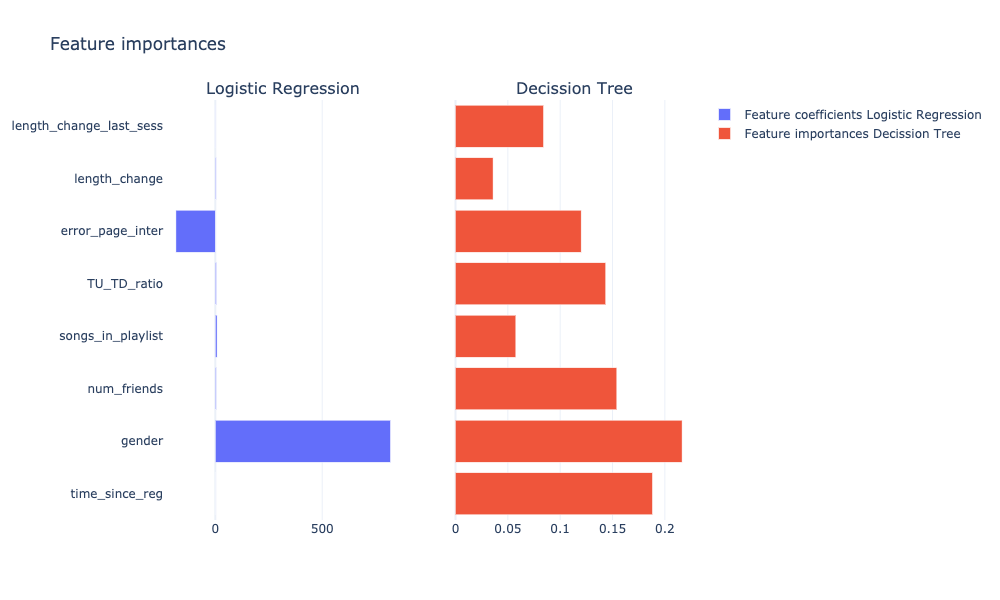

# Udacity Capstone Project: Sparkify

This repository contains the code for the capstone project of my UdaCity Data Science course applying using the [spark](https://spark.apache.org/docs/latest/api/python/index.html) library and its python api pyspark.

# Project Motivation

Insights about their users and estimation about their behavior is of upmost imporatance companies that rely on a interactive paltform. Based on those findings the provided content and used concept can be adjusted to garantee a good user experience, freequent and longterm interaction and therefore profit for the company. For platfroms, that use a two level subscription model with free and paid subscription the prediction about likeleyhood of the users to churn and switch from a paid to free subscription is therefore of intrest. Based on those insights individualized offers or pricing can be used influence their decission and keep their paid subscription. In this work we investigate the interaction behavior of users of the music platform "sparkify", try to find determining factors that influence their decision to cancel their paid subscription and develop a model that allows the classification of users based on those factors. For the analysis and the modelling we use spark and the python api pyspark. This library was designed to allow wrangeling and modelling of data that is considered "big data" and can not be processed with only one machine. In this notebook we demonstrate the principales, using a 128 MB subset of the 12 GB data.

# Results

- Churn relates to:
    - User attributes and information (gender)
    - Time they spend on the platform
    - Enjoyment of the content
    - Networking over the plateform

- Modelling achived good classification results
- Decission Tree is the prefered model
- The models have to be tested on a larger amount of data to verify the applicability for more users

### Data


Classification objective: classification of 225 unique users in canceling users (52) and non-canceling users 173) 

### Engineered Features
Information and attributes of the user
- Time difference between registration and last time stamp: To consider influence of time since registration
- Gender: To consider influence of gender

Change of interaction behavior:
- Trend of time spend per session: To consider long-term intrest in the platform for users with a lot of interactions
- Trend time spend in last interaction: To consider short-term intrest in the platform e.g. users that only use the platform for 1 or two session, or a sudden                                                  decission

Liked content
- Radio of Thumps up to thumps down: To consider overall liking of the offered music and the mood
- Number of Songs in Playlist: To consider if content is liked and if longer interaction is anticipated

Networking
- Number of Friends: To consider if users network over the platform

Malfunctions and erros of function
- Number of interactions with error page: To consider effect of malfunctions of the plaform

### Classification Results





Classification reports cross validation (75%):

Logistic Regression
```python
precision    recall  f1-score   support

           0       1.00      1.00      1.00       136
           1       1.00      1.00      1.00        42

    accuracy                           1.00       178
   macro avg       1.00      1.00      1.00       178
weighted avg       1.00      1.00      1.00       178
```

Decision Tree
```python
precision    recall  f1-score   support

           0       1.00      1.00      1.00       136
           1       1.00      1.00      1.00        42

    accuracy                           1.00       178
   macro avg       1.00      1.00      1.00       178
weighted avg       1.00      1.00      1.00       178
```



Classification reports validation with hold-off data (25%):

### Feature Importances


Logistic Regression
```python
precision    recall  f1-score   support

           0       1.00      1.00      1.00        37
           1       1.00      1.00      1.00        10

    accuracy                           1.00        47
   macro avg       1.00      1.00      1.00        47
weighted avg       1.00      1.00      1.00        47
```

Decision Tree
```python
precision    recall  f1-score   support

           0       1.00      1.00      1.00        37
           1       1.00      1.00      1.00        10

    accuracy                           1.00        47
   macro avg       1.00      1.00      1.00        47
weighted avg       1.00      1.00      1.00        47
```

# File Description
```
.
├── README.md                           - Readme
├── Sparkify.ipynb                      - Notebook containing analysis and modelling
├── mini_sparkify_event_data.json.zip   - Compressed data due to data size
├── requirements.txt                    - Required libraries for setup
└── static                              - Images for Readme
    ├── ROC_CV.png
    ├── ROC_hold-off.png
    ├── comparison_number_users_cancel_non_cancel.png
    ├── conv_mat_DT_CV.png
    ├── conv_mat_DT_hold-off.png
    ├── conv_mat_LR_CV.png
    ├── conv_mat_LR_hold-off.png
    └── feature_importance.png
```
# Setup

## Install Requirements
```bash
    pip install -r requirements.txt
```

## Install Kernel for Jupyter (if new Enviroment)
```bash
    python -m ipykernel install --name name_of_enviroment
```
